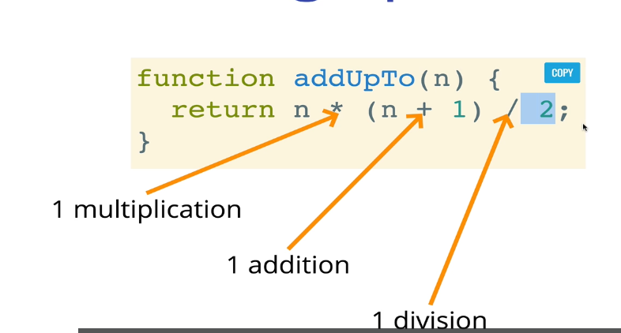

# 알고리즘

날짜: 2022년 6월 3일
태그: Algorithm

## 빅오

### 4. 빅오 소개

어떤 문제에는 해결법이 여러가지가 존재한다. 이 방법 중 어떤 방법이 가장 나은 방법인가? 에 대한 고민을 해결해주는 것이 빅오이다. 숫자로 코드의 성능을 표기해준다. 코드의 성능을 이야기할 떄 정확한 전문용어를 사용하는 것이 중요하다. 

### 5. 코드 시간 재기

```jsx
function addUpTo1(n) {
    let total = 0;
    for (let i = 0; i < n; i++) {
        total += i;
    }
    return total;
}

function addUpTo2(n) {
    return n * (n + 1) / 2;
}
```

1~6까지 숫자를 더 하라는 문제가 있을 때 나올 수 있는 두 가지 방법이다. 두 방법 중 어떤 방법이 더 나은가? 여기서 중요한 건 ‘더 낫다’ 라는 건 무엇을 의미할까. 빠른 것? 메모리를 덜 사용하는 것? 가독성이 높은 것? 기본적으로는 속도에 집중한다.

```jsx
function addUpTo1(n) {
    let total = 0;
    for (let i = 0; i < n; i++) {
        total += i;
    }
    return total;
}

function addUpTo2(n) {
    return n * (n + 1) / 2;
}

const t1 = performance.now();
addUpTo1(100000000);
const t2 = performance.now();
console.log(`첫번째 함수 걸린 시간 : ${(t2 - t1) / 1000} 초`)
// 첫번째 함수 걸린 시간 : 0.0665 초

const t3 = performance.now();
addUpTo2(100000000);
const t4 = performance.now();
console.log(`두번째 함수 걸린 시간 : ${(t4 - t3) / 1000} 초`)

// 두번째 함수 걸린 시간 : 0.00010000002384185791 초
```

시간을 보면 아래 코드가 더 낫다. 하지만 이런 식으로 비교하는 건 불확실하고 믿기 어렵다. 환경에 따라 측정되는 시간이 다르고 정말 빠른 알고리즘 같은 경우는 작은 차이를 구분하기 어렵다. 그럼 시간을 측정하지 않고 비교하는 방법은 무엇이 있을까?

### 6. 연산 갯수 세기

시간을 사용하지 않는다면 우리는 어떻게 해야할까? 바로 컴퓨터가 처리해야할 연산 개수를 세면된다. 어떤 알고리즘이 실행되기 위해 연산이 5개가 실행되고 다른 건 7개가 실행된다면 당연히 전자가 낫다.



위에서 작성한 코드의 경우 연산이 세 번 들어간다. n의 값과는 상관없이 항상 3번 연산된다.


해당 코드는 n의 개수만큼 연산된다. n이 5면 5번, 1억이면 1억번.  하지만 정확한 연산 개수는 중요하지 않다. 전체적인 추세만 확인하면 된다.

### 7. 시간 복잡도 시각화


파란색 선이 효율이 좋지 않은 코드 회색 선이 효율이 좋았던 코드

### 8. 빅오에 대한 공식 소개

- Big O Notation is a way to formalize fuzzy counting
- 빅오는 대략적으로 숫자를 세는 것에 붙인 공식적인 표현이다.
- It allows us to talk formally about how the runtime of an algorithm grows as the inputs grow
- 정식으로 입력된 내용이 늘어날 수록 알고리즘에 실행 시간이 어떻게 변하는지 설명하는 공식적인 방식이다.
- We say the an algorithm is **O(f(n))** if the number of simple operations the computer has to do is eventually less than a constant times **f(n)**, as **n** increase
- N이 커질 수록 컴퓨터가 f(n) 상수 곱하기 f(n)보다 간단한 연산을 덜 한다면 그 알고리즘을 O(f(n))이라고 표현한다.
- f(n) could be linear (f(n) = n)
- f(n) could be quadratic (f(n) = n *n )
- f(n) could be constant (f(n) = 1)
- f(n) could be something entirely different!


위와 같은 코드는 두 번 반복되기 때문에 O(2n)이라고 생각할 수 있지만 01_bigO는 항상 큰 그림만 본다. 결론적으로는 O(n)이다.


for문이 중첩된 경우는 O(n * n)이다.


### 9. 빅오 표현식의 단순화하기

가장 중요한 건 상수는 중요하지 않다.

```jsx
O(2n) ❌ O(n) ⭕
O(500) ❌ O(1) ⭕
O(13n^2) ❌ O(n^2) ⭕

O(n + 10) ❌ O(n) ⭕
O(1000n + 50) ❌ O(n) ⭕
O(13n^2 + 10n + 20) ❌ O(n^2) ⭕
```

가장 단순한 것만 보인다.

1. 산수는 상수이다. 
2. 변수도 상수이다.
3. 배열이나 오브젝트에 접근하는 것도 상수이다.


### 10. 공간 복잡도

입력이 커질수록 알고리즘이 얼마나 많은 공간을 차지하는지에 대한 이야기이다. 빅오에는 공간 복잡도와 시간 복잡도가 있다.

**공간 복잡도(auxiliary space complexity)** 입력되는 것을 제외하고 알고리즘 자체가 필요로 하는 공간을 의미한다.

n이 커질수록 입력 자체도 커진다.

대부분의 원시값(boolean, numbers, undefined, null)은 **불변 공간(constant space)**이다. 그렇기 때문에 입력의 크기와는 상관없이, 숫자가 1이든 1000이든 모두 불변 공간이라고 여깁니다.

문자열은 조금 다르다. 문자열은 1이면 1을 차지하고 50이면 50을 차지한다. O(n) 참조 타입도 문자열과 비슷하다.


파라미터인 arr는 계산에 영향을 주지 않는다.


arr이 존재해도 결국 n개 이기 때문에 O(n) 이다.

### 11. 로그와 섹션 요약

빅오에 로그가 포함되는 경우가 많다.


로그함수는 지수함수의 짝이다. 나눗셈이 곱셈과 짝인 것처럼. 가장 흔한 것은 이진 로그이다. 로그 옆에 작은 숫자가 적히지 않으면 2가 숨겨져있다고 이해하면 된다.


자세히 이해할 필요는 없다. 그저 로그n이 n보다 더 효율이 좋구나. 이정도만 알면된다.

효율적인 알고리즘은 로그와 관련되어 있다. 

<aside>
💡 1. 알고리즘의 효율 측정을 위해 빅오 표기법 사용한다.

2. 빅오는 실행 시간이나 공간 복잡도에 대해 알려준다.

3. 빅오는 정확도가 아니라 전체적인 추세가 중요하다.

4. 빅오로 측정되는 알고리즘의 시간과 공간 복잡도는 하드웨어에 영향받지 않는다.

</aside>
