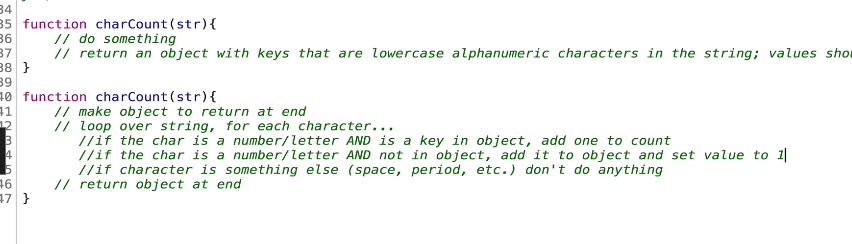

# 섹션4: 문제 해결 접근법

### 18. 문제 해결법 소개

알고리즘이란 무엇일까요? 특정 작업을 달성하기 위한 과정이나 일련의 단계를 의미한다. 

왜 이걸 알아야할까요? 프로그래밍에서 수행하는 거의 모든 작업에서는 모두 알고리즘을 포함한다. 아주 기본적이든 복잡하든 상관없이 말이다. 무엇보다 면접에서 항상 질문이 나온다.

어떻게 해야 더 잘 이해할 수 있을가요? 첫 번째 문제 해결을 위한 계획을 수립한다. 두 버째는 일반적인 문제 해결 패턴을 파악한다. 

### 19. 1단계:문제의 이해

무엇보다 어려운 건 새로운 도전과 문제 해결이다. 다만 신중할 필요가 있다. 단계별로 지침을 세울 필요가 있다. 

가장 먼저 해야할 것은 문제를 이해하는 것이다. 제대로 이해하지 못하더라도 진행할 수 있다. 특히 프로그래밍이 그렇다. 하지만 코드를 적기 전에 확실히 이해하는 것이 중요하다.

스스로 던져보아야 할 질문은 이렇다. 

1. Can I restate the problem in my own words?
문제를 자신의 방식대로 다시 생각할 수 있나요? 
    
    면접관의 말을 그대로 생각하는 것이 아니라 자신만의 방식으로 바꿔서 질문이 무엇인지 실제로 이해하는 것이다.
    
2. What are the inputs that go into the problem?
문제가 어떤 입력값을 담고 있는가?
3. What are the outputs the should come from the solution to the problem?
문제에 대한 해결책에서 나와야 할 결과는 무엇일까요?
4. Can the outputs be determined from the inputs? In other words, do I have enough information to solve the problem? 
입력값이 출력값을 결정할 수 있을까요? 그러니까 문제를 풀기위한 충분한 정보가 있을까요?
5. How should I label the important pieces of data that are a part of the problem?
문제의 일부인 데이터의 중요한 부분에 어떻게 라벨을 지정할 수 있을까요?

### 20. 2단계: 구체적 예제들

예시를 떠올리는 것은 문제를 잘 이해는 것에 도움이 된다. 예시는 온전성 검사를 제공하므로 최종 해결책을 입력했다면 제대로 작동하는지 검사할 수도 있다.

User Story, Unit Test

1. 가장 간단한 예시로 시작한다. 입력값과 출력값을 입력해둔다. 그 다음 2. 더 복잡한 예시를 넣는다. 3. 이후 빈 입력값이 있는 예제를 살펴본다. 4. 특히 유효하지 않은 입력값이 주어진 면접 상황에서 문제를 어떻게 해결해야 할지 해결 능력을 갖출 수 있도록 해준다.

### 21. 3단계: 세부분석

**Break It Down**

면접관은 소통하길 원한다. 문제를 하나씩 쪼개는 세분화하기를 원한다. 코드를 작성하기 전에 방법을 한 두줄이라도 방법을 작성해야한다. 



이렇게 방법을 차근차근 적으면 문제를 완벽하게 풀지 못하더라도 테스트에 합격하는 경우를 많이 봤다. 

### 22. 4단계: 해결 또는 단순화

**Solve/Simplify**

어떻게 풀지는 몰라도 어디서부터 시작해야할지 안 다면 시작부터 하는 것이 좋다.


만약 소문자로 만드는 것이 기억 나지 않는다면 가능한 것부터 실행하다. 그러면 면접관이 힌트를 줄 것이다. 만약 유효한 문자인지 확인하는 작업을 추가한다면 if문을 추가할 것이다. 문제 자체는 어렵지 않지만 선택할 수 있는 방법이 여러가지이다.

성급하게 무언가 작성하기보다 페이지에 뭐든 작성하여 작동하기 바라되, 일단 어려운 부분을 파악한 후 바로 연결할 수 있도록 올바른 부분을 적합한 위치에 두는 것이 훨씬 좋습니다.

### 23. 5단계: 되돌아보기와 리팩터(Refactor)

**Look Back & Refactor**

코드가 아름다울 필요도 없고 지구상에서 가장 효율적일 필요도 없지만 목표를 달성하기 위해 노력하는 것이 정말 중요하다.

대부분 코드를 볼때 중요시 여기는 것은 효율성이지만 대체로 효율성과 가독성이라는 두 기둥 사이에서 균형을 맞춰야 할 필요가 있다.

문제를 푼 것에서 끝내지 않고 면접관에가 다른 사람은 같은 문제를 어떻게 해결했는지 확인하는 것도 좋다. 그 과정에서 배울수 있는 점이 많다. 꼭 자바스크립트가 아니라 파이썬이나 자바로는 어떻게 접근했는지 확인하는 것도 좋은 방법이다.

코드를 분석하고 성찰하고 되돌아보는 것이 그저 작동하도록 코드를 작성하고 하루를 마감하는 것보다는 가치가 있다.


정규식보다 charCodeAt 이용하는 것이 50% 빠르다


### 24. 복습과 인터뷰 전략

1. Understand the Problem
문제를 이해한다. 
2. Explore Concrete Examples
복잡한 예제를 찾아본다
3. Break I Down
세분화한다. 이 단계가 특히 면접에 도움된다.
4. Solve/Simplify
단순화 하면 핵심적인 부분만 남아서 어려움이 사라진다. 모르는 부분이 있으면 무시하라
5. Look Back and Refactor
완전히 숙련된 개발자도 다른 사람의 코드를 많이 참고한다. 

이 모든건 면접에서도 중요하지만 현실에서도 더 중요하다

```jsx
let obj = {}

const str = "hello"

{
	for (let i = 0; i < str.length; i++) {
    const char = str[i];

    if (obj[char] > 0) {
      obj[char] = obj[char] + 1;
    } else {
      obj[char] = 1;
    }
    console.log(obj);
  }
}

function getStrObj(str) {	
	const lowerCase = str.toLowerCase()
	const removedBlank = lowerCase.trim(" ")
	const charList = removedBlank.split("");
	
	const result = charList.reduce((target, key) => {
		if (target[key] > 0) {
			target[key] = target[key] + 1;
		} else {
			target[key] = 1;
		}
		
		return target;
	}, {});
	
	return result	
}
function charCount(str) {
  const lowerCase = str.toLowerCase();
  const removedBlank = lowerCase.trim(" ");
	const 특수문자제거 = removedBlank.replace(/[^a-z|0-9]/g, "");
	const charList = 특수문자제거.split("");

  const result = charList.reduce((target, key) => {
		target[key] = target[key] + 1 || 1;
  
    return target;
  }, {});

  return result;
}

const isAlphaNumeric = function(char) {
	const code = char.charCodeAt(0);
	if(!(code > 47 && code < 57) && // numeric (0-9)
		!(code > 64 && code < 91) && // uppse alpha (A-Z)
		!(code > 96 && code < 123)) { // loswer alpha (a-z)
			return false;
		}
};
console.log(charCount("hello!"));
```